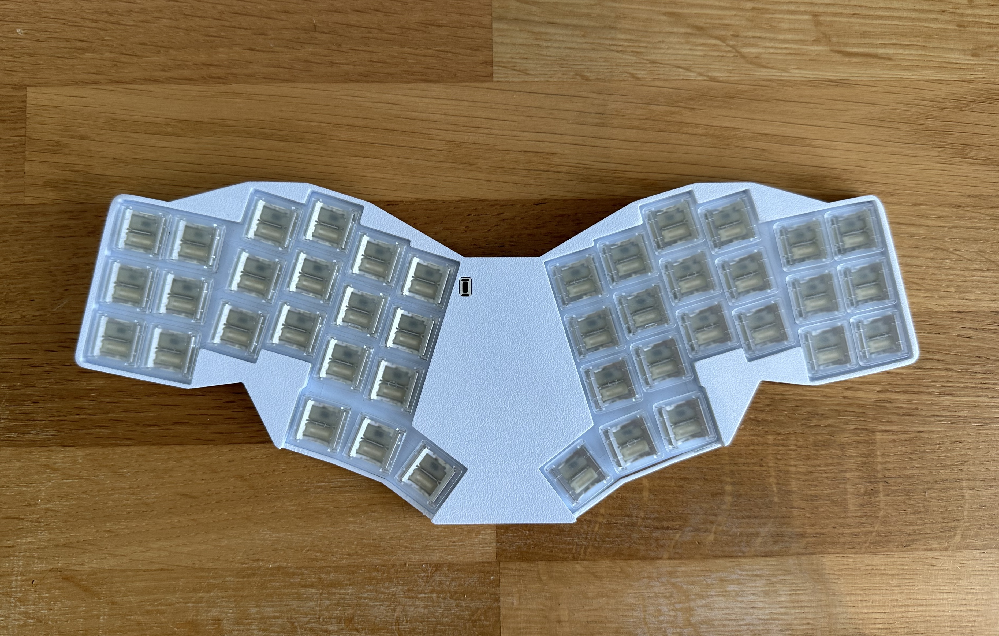
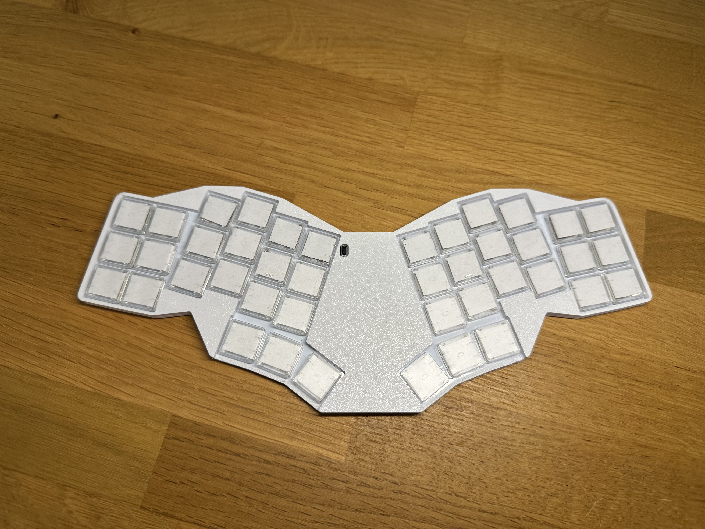

# Wingman



this has the papermod applied, which makes the switches sound much better


## What makes this unique in the sea of other pg1316s based boards ?
- This board can be 100% hand soldered with a normal soldering iron. No hot plate required
- The custom footprint makes soldering the switches quite managable, compared to hot plate soldering the switches to smd pads 
- A 42 key layout

### Other features
- Only 6mm thick (1mm was sacrificed to add a backplate to cover the backside of the pcb )
- Comes with full zmk support including zmk studio for easy remapping
- Extremly light and portable

### Disclaimer
- Even though this can be hand soldered, this is an **advanced project**,    
if you have never built a keyboard I would advise against this being your first project 
- You will need a good soldering iron and well flowing solder, but please use lead free. Flux helps with the soldering process, so be sure to have it on hand. I was able to manage soldering without, so it is possible to manage without.
- Make sure to work in a well ventilated area and wash your hands afterwards.
- These switches are super unforgiving. You will most likely not be able to desolder these once attached.
**Take you time and be aware that one simple mistake could ruin the whole board**
- Out of the box these switchs sound horrendous, you will need to do some mods. [Mikeholscher](https://github.com/mikeholscher/zmk-config-mikefive/tree/main/files/mods) has some guides . I am still experimenting. 


## PCB ordering guide
- 1mm thickness is a must. The case is designed for 1mm thickness.
- Choose a nice solder mask color, as this will be visible. White or black will look best with most case colors.
- For safety reasons, I would recommend to go with the lead free HASL finish
unfortunately, this combo gets a bit expensive, but it is necessary to have proper fit and look.


### Bom
- 1x Pcb (gerbers can be found in /gebers ), choose 1mm thickness and a nice color, if you plan to use transparent keycaps
- 1x [Nice Nano v2](https://42keebs.eu/shop/parts/controllers/nice-nano-v2-wireless-controller/) (buy them with the individual mill max pins, not the row)
- 42x 1N4148W SMD Diodes
- 42x PG1316S switches (buy at least 50 to have some spares)
- 42x PG1316S keycaps (you won't really need spares here)
- 1x [ 2 pin reset switch](https://42keebs.eu/shop/parts/components/reset-switch/?attribute_type=Through-hole%202-pin%206x3&attribute_pa_colour=black)
- 1x [Power switch](https://42keebs.eu/shop/parts/components/power-switch/)
- 1x [Battery](https://42keebs.eu/shop/parts/lithium-polymer-battery/?attribute_size=301230%20(110%20mAh)) (the format is very important, especially the thickness. anything above 3mm will not fit into the case)
- 10x [M2 2mm depth x 3.5mm diamter threaded inserts](https://www.amazon.de/dp/B0D9YK4PY1)
- 10x [M2 3mm flat head screws](https://www.amazon.de/dp/B0D4557749)
- 1x Top part of the case
- 1x Bottom part of the case


### Build guide
- Big parts of the guide are missing.
- I plan to make a video guide.

#### Soldering the diodes
1. Check the direction of the diode. Check you have the right direction with a multimeter.
2. ...
#### Soldering the swiches
1. All diodes **have** to be soldered at this point. There is no turning back once a switch is soldered. 
2. Solder column by column. Place one row of switches on the board. Make sure the switches fall into their alignment holes
3. Tape them to the pcb, making sure they have not moved. 
4. Flip the board so you see the pads from the bottom of the pcb
5. Drop solder into the holes inside the pads. Make sure the solder flows into the holes and has time to flow well. 
6. Check the continuity of the switches with a multimeter, make sure they are all working. This will save you a lot of frustration.
7. Remove the tape and flip the pcb back to the top side.
8. Continue with the next column
#### Printin instructions for the case (FDM)
- Print with a 0.2mm nozzle on the best / most accurate setting. Otherwise the very thin walls for the main compartment will not print correctly
- Print the top part top side down, for a smoother finish
- To avoid warping, print the parts with less than 30% infill

### Notes
- Thanks to mike for the base footprint files for the pg1316 switch. Check out his pg1316s based keyboard [here](https://github.com/mikeholscher/zmk-config-mikefive), I took his footprint and modified it to make soldering much easier with phts inside the pads.      
Futhermore, he helped me finalize this project and offered many of his insights. Please check out his [profile](https://github.com/mikeholscher) and give him a star on his work.


## Modification guide

### If you want to modify or build yourself
1. Clone the repo

```bash
git clone --recursive <this repo>
```
recursive for the submodule containing extra footprints   

2. Run ergogen which will build the pcbs
```bash
npm install -g ergogen
ergogen .
```
3. Go into the output directory and open it with pcbnew (KiCAD)
4. Do the routing / modifications
5. Upload the gerbers to a pcb manufacturer
6. Follow the guide about assembly


### Or just build the premade version
1. Zip the gerber directory
2. Upload to a pcb manufacturer
3. Assemble the board


