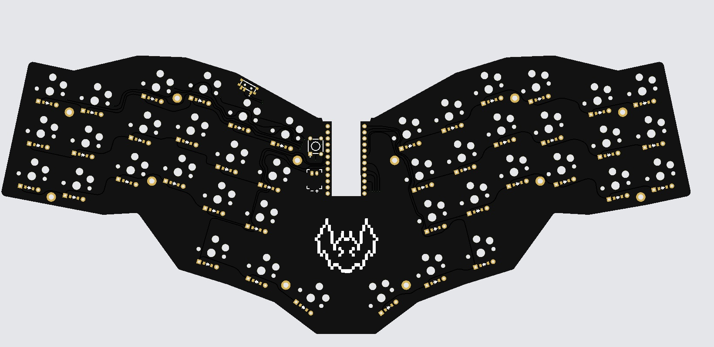

### Goals
- small and thin portable board that could sit on my laptop
- keep the layout I am used to


## Ultra low profile version
- Check out the [ultra_low_profile branch](https://github.com/vuoz/keebat/tree/ultra_low_profile)    for the ultra low profile version of this keyboard    
that uses kailh PG1316s switches    
**This is still a work in progres**


## Small guide

### If you want to modify or build yourself
1. Clone the repo

```bash
git clone --recursive <this repo>
```
recursive for the submodule containing extra footprints   

2. Run ergogen which will build the pcbs
```bash
npm install -g ergogen
ergogen .
```
3. Go into the output directory and open it with pcbnew (KiCAD)
4. Do the routing / modifications
5. Upload the gerbers to a pcb manufacturer
6. Follow the following guide about assembly


### Or just build the premade version
1. Zip the gerber directory
2. Upload to a pcb manufacturer
3. Assemble the board

#### Bom
- 42 choc low profile v1 switches [e.g one of these](https://splitkb.com/products/kailh-low-profile-choc-switches)
- 42 smd diodes (1N4148W)
- 1 [nice nano v2](https://nicekeyboards.com/nice-nano/)
- 1 [reset button](https://42keebs.eu/shop/parts/components/reset-switch/?attribute_type=Through-hole%204-pin%206x6&attribute_pa_colour=black)
- 1 [on / off switch](https://42keebs.eu/shop/parts/components/power-switch/)
- 42 choc keycaps 
- (optionall) printed plate and case


### Preview: 
coming as soon as I get the pcbs   



#### Assembly
- Visual guide will follow as soon as i receive the pcbs


### Notes
- Thanks to [dustdfg](https://dustdfg.itch.io/pixel-art-bat-1bit) for the pixel art

